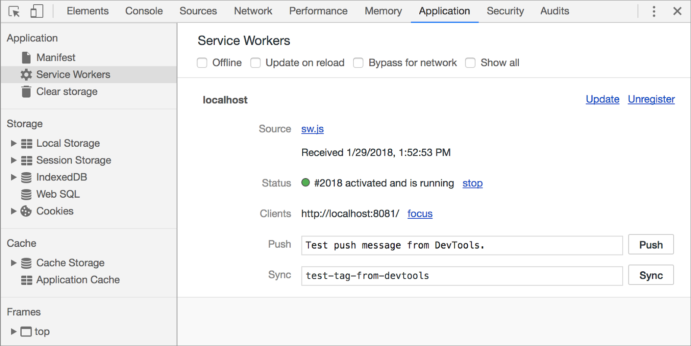
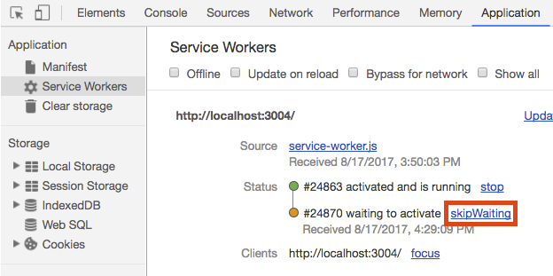
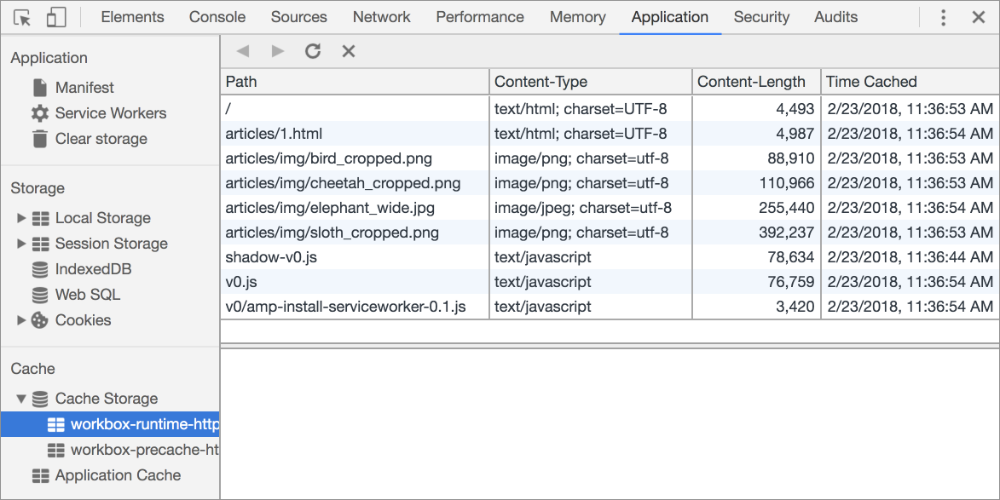
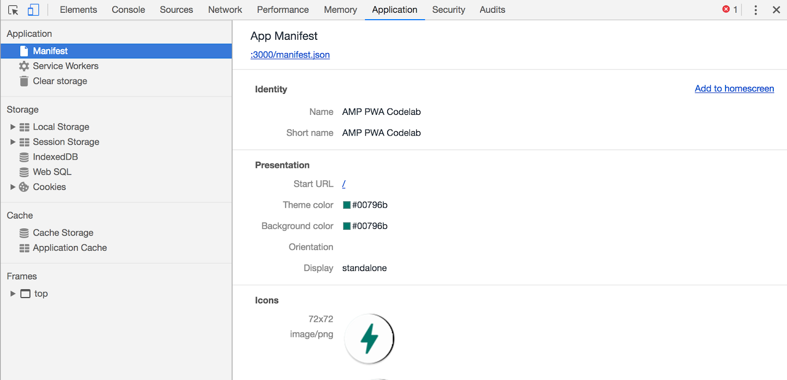
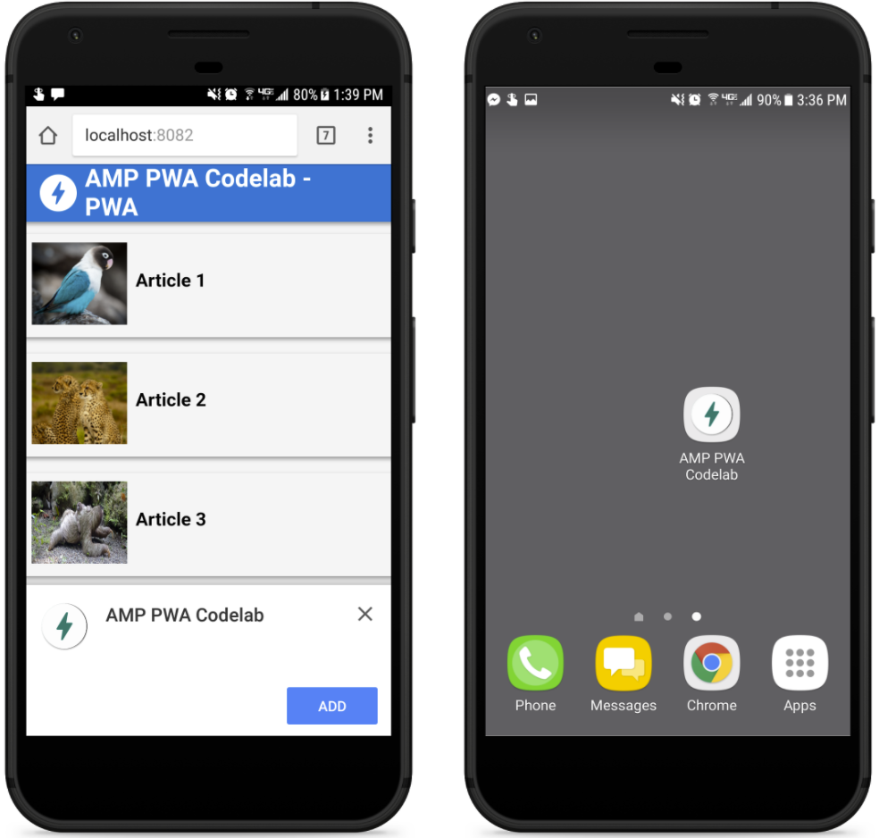

project_path: /web/_project.yaml
book_path: /web/ilt/pwa/_book.yaml

{# wf_auto_generated #}
{# wf_updated_on: 2018-09-05 #}
{# wf_published_on: 2016-01-01 #}


# Lab: Build a Progressive Web AMP {: .page-title }


<div id="overview"></div>


## Overview


Accelerated Mobile Pages (AMP) is a way to build pages for static content that render fast. Progressive Web Apps (PWA) are reliable, fast and engaging experiences on the web. There are several ways in which a developer can use AMP components to build a PWA experience on their website.

This lab walks you through implementing two different AMP + PWA patterns: 1) transforming an AMP site into a PWA, and 2) enhancing it using the App Shell architecture.

#### What you'll learn

* How to transform an AMP canonical site into a PWA
* How to enhance the experience using the AMP pages as a base for an app shell

#### What you should already know

* Basic knowledge of HTML, CSS, JavaScript, and Chrome DevTools
* How to run commands from the command line
* Some familiarity with service workers and Workbox is recommended
* Some familiarity with  [AMP](https://codelabs.developers.google.com/codelabs/accelerated-mobile-pages-foundations/#0) structure and restrictions is recommended

#### What you will need

* A recent version of Chrome
* A browser that  [doesn't support service worker](https://jakearchibald.github.io/isserviceworkerready/#service-worker-enthusiasm) (to test fallback code)
* Node.js and npm
* The sample code (download or clone via git)
* A text editor or web IDE

<div id="1"></div>


## 1. Get set up


If you have not downloaded the  [repository](https://github.com/google-developer-training/pwa-training-labs) and installed  [the LTS version of Node.js](https://nodejs.org/en/), follow the instructions in [Setting up the labs](setting_up_the_labs.md).

Navigate into the `amp-pwa-lab/project/` directory and start a local development server:

    cd amp-pwa-lab/project
    npm install
    node server.js

You can terminate the server at any time with `Ctrl-c`.

#### Explanation

In this step, the project dependencies are installed based on the configuration in `package.json`. Open `package.json` and examine its contents. The package we are concerned with in this lab is `workbox-cli`, which is a command-line tool that allows us to inject a file manifest into a source service worker file.

Note: You can learn more about Workbox in  [this codelab](https://codelabs.developers.google.com/codelabs/workbox-lab/#0).

The `build` script in `package.json` is how we will use `workbox-cli` in this lab.

### 1.1 Open the app and explore the code

After you start a local server, open the browser and navigate to localhost:8081 to view the app. The app is made up of a set of AMP pages that link to each other. The goal of this lab is to make the app into a PWA.

Note: [Unregister](/web/ilt/pwa/tools-for-pwa-developers#unregister) any service workers and  [clear all service worker caches](/web/ilt/pwa/tools-for-pwa-developers#clearcache) for localhost so that they do not interfere with the lab. In Chrome DevTools, you can do this in one easy operation by going to the __Application__ tab, clicking __Clear Storage__ and then clicking the __Clear site data__ button.

Open the `amp-pwa-lab/project/` folder in your text editor. The `project/` folder is where you build the lab.

<div id="2"></div>


## 2. Cache the static resources


### 2.1 Write the source service worker

Let's start by using `workbox-sw` to write a source service worker. Add the following code to `src/sw.js`:

```
importScripts('https://storage.googleapis.com/workbox-cdn/releases/3.4.1/workbox-sw.js');

workbox.precaching.precacheAndRoute([]);
```

This code imports the `workbox-sw.js` library. Once the library is loaded, the `workbox` object gives our service worker access to the  [Workbox modules.](/web/tools/workbox/modules/)

The `precacheAndRoute` method of the `precaching` module takes a manifest of URLs to cache on service worker installation. `precacheAndRoute` intelligently updates the cache and sets up a fetch handler to respond cache-first for requests to URLs in the manifest.

In the next step you use `workbox-cli` to generate the manifest automatically. You can learn more about Workbox in  [this lab](/web/ilt/pwa/lab-workbox).

### 2.2 Build the production service worker

When using Workbox, it is recommended that you generate the list of files to precache using one of the Workbox build modules. This allows Workbox to create hashes of your files and intelligently update the caches when you edit your files.

Create a file in `project/` and name it `workbox-config.js`. Add the following content to the file:

```
module.exports = {
  "globDirectory": "./",
  "globPatterns": [
    "img/**.*"
  ],
  "swSrc": "src/sw.js",
  "swDest": "sw.js",
  "globIgnores": [
    "./workbox-config.js"
  ]
};
```

Now, `workbox-cli` can be used to generate the precache file list. From the `project/` directory run:

    npm run build

Note: If the development server is blocking your command-line, open another command line window or tab.

This command aliases to `workbox injectManifest` in the `package.json` file. Notice that a `sw.js` file was created in the `project/` directory. Open `project/sw.js` and observe that `img/amp_logo_white.svg` has been added to the `precacheAndRoute` call along with a revision hash of the file.

#### Explanation

`workbox-cli` uses the settings in the config file to build a new service worker file. The `injectManifest` command copies the source service worker (`src/sw.js`) to the destination service worker (`/sw.js`), and adds the list of files matched by the `globPatterns` to the `precacheAndRoute` method in the destination service worker. After this service worker is installed in the browser, it precaches the `globPatterns` resources. We install the service worker in a later step.

### 2.3 Precache dynamic assets

There may be some resources that we want to precache but which we do not want serve with the cache-first strategy implicitly created by the `workbox.precaching.precacheAndRoute()` call. The AMP libraries are a good example of this. We want them to be cached on the first load, but we also want them to update dynamically at runtime, since they are maintained by a third party and could change at any time.

For these types of assets we need to write our own install event handler.

Note: Be sure to write all your service worker code in the source service worker (`src/sw.js`) and not the build service worker (`/sw.js`), since the build service worker is overwritten when running `npm run build`.

Add the following code to `src/sw.js`:

```
self.addEventListener('install', event => {
  const urls = [
    'https://cdn.ampproject.org/v0.js',
    'https://cdn.ampproject.org/v0/amp-install-serviceworker-0.1.js',
    'https://cdn.ampproject.org/shadow-v0.js'
  ];
  const cacheName = workbox.core.cacheNames.runtime;
  event.waitUntil(caches.open(cacheName).then(cache => cache.addAll(urls)));
});
```

This adds the AMP libraries to the runtime cache on service worker install. By caching the libraries in the runtime cache, we are able to update them dynamically in a future step.

Note: You may notice that the app currently only uses the `v0.js` library, but the other two libraries are needed in future steps, so we add them here for convenience.

Update the production service worker using `workbox-cli`. From the `project/` directory, run:

    npm run build

Observe the changes in `project/sw.js`.

<div id="3"></div>


## 3. Install the service worker from AMP


Generating the service worker script is only half the task. The next step is installing the service worker from the AMP pages. AMP provides the  [`amp-install-serviceworker`](https://www.ampproject.org/docs/reference/components/amp-install-serviceworker) component to do this for us.

Add the `amp-install-serviceworker` JavaScript to the end of the head section of each AMP page:

```
<script async custom-element="amp-install-serviceworker" src="https://cdn.ampproject.org/v0/amp-install-serviceworker-0.1.js"></script>
```

Next, add the `amp-install-serviceworker` component to the bottom of each AMP page, right before the `</body>` tag:

```
<amp-install-serviceworker
  src="/sw.js"
  layout="nodisplay"
  data-iframe-src="/install-service-worker.html">
</amp-install-serviceworker>
```

This component registers the service worker using the file specified in the `data-iframe-src`. Let's write that file now. In `project/`, create an `install-service-worker.html` file with the following content:

```
<!doctype html>
<html>
  <head>
    <title>Installing service worker</title>
    <script type="text/javascript">
      if ('serviceWorker' in navigator) {
        window.addEventListener('load', () => {
          navigator.serviceWorker.register('sw.js')
          .then(swReg => {
            console.log('Service Worker is registered', swReg);
          })
          .catch(err => {
            console.error('Service Worker Error', err);
          });
        });
      }
    </script>
  </head>
  <body>
  </body>
</html>
```

Save the file and refresh the page in the browser.

In Chrome Developer Tools, navigate to the __Application__ tab and click __Service Workers__. You should see the service worker information, which looks similar to this:



You should also see that the `amp_logo_white.svg` file was stored in the precache cache (`workbox-precache`) and the AMP libraries were stored in the runtime cache (`workbox-runtime`). From the same __Application__ tab, right-click __Cache Storage__ and choose __Refresh Caches__. Expand __Cache Storage__ to see the resource stored in the cache, similar to the following:


#### Explanation

In this step we added the  [`amp-install-serviceworker`](https://www.ampproject.org/docs/reference/components/amp-install-serviceworker) component to each AMP page, and configured the component to install the production service worker (`sw.js`). AMP doesn't allow third party JavaScript directly, but the `amp-install-serviceworker` component has an extra attribute called `data-iframe-src` that loads a URL as an iframe. In this case, we've configured `install-service-worker.html` as the resource to be loaded, which registers and installs the service worker.

<div id="4"></div>


## 4. Cache dynamic content


You just took the first step towards transforming your AMP site into a PWA by creating and installing a service worker that caches static content. Now we want to cache dynamic content (such as each AMP page) when it's loaded.

### 4.1 Cache visited pages

To cache pages the user has visited, we must add routes to the service worker.

Add the following code to the bottom of `src/sw.js`:

```
workbox.routing.registerRoute(/\/articles\/(.*)html|(.*)\/$/,
  workbox.strategies.networkFirst()
);

workbox.routing.registerRoute(/\.(?:js|css|png|gif|jpg|svg)$/,
  workbox.strategies.cacheFirst()
);
```

Save the file.

#### Explanation

The `registerRoute` method takes a regular expression URL pattern and a callback to handle requests matching that pattern. The first route intercepts requests for articles (you can learn more about  [Regular Expressions here](https://developer.mozilla.org/en-US/docs/Web/JavaScript/Guide/Regular_Expressions)) and uses the network-first strategy to respond. The second route intercepts requests for the articles' assets, such as images and CSS. This route responds with the cache-first strategy. Both of these built-in Workbox strategies dynamically cache resources when they are loaded.

Note: When implementing a caching strategy for your pages, make sure to use a strategy that properly fits your business needs. Workbox has  [several caching strategies](/web/tools/workbox/reference-docs/prerelease/workbox.strategies) available, and it's also possible to mix and match to create your own, as in the example above.

### 4.2 Add a route for the AMP runtime

So far, our code caches the article pages and supporting content, and caches the AMP libraries in the runtime cache on install. We still need to add a route that dynamically updates the AMP libraries, since they are 3rd party resources and can change at any time.

Append the following route to `src/sw.js`:

```
workbox.routing.registerRoute(/(.*)cdn\.ampproject\.org(.*)/,
  workbox.strategies.staleWhileRevalidate()
);
```

#### Explanation

This route caches the AMP libraries using the `staleWhileRevalidate` strategy. This strategy requests the resource from the cache and network in parallel, and then responds with the cached version. When the network request completes, the cache is updated with the newest version of the resource, so that it can be served on the next request.

### 4.3 Cache a custom offline page

Let's add one final feature. Currently, when a visitor goes to a previously visited article while offline, they see a cached version of the page. But if the user clicks a link that wasn't previously visited, they see the browser's default offline page. By using a service worker, it's possible to serve a customized offline page.

In `project/`, create a file called `offline.html` and add this code:

```
<!doctype html>
<html>
  <head>
    <meta charset="utf-8">
    <title>The Photo Blog - Offline</title>
    <meta name="viewport"
          content="width=device-width,minimum-scale=1,initial-scale=1">
  </head>
  <body>
    <h1>You are Offline</h1>
  </body>
</html>
```

In `workbox-config.js`, add `offline.html` to the list of static files to cache in the `globPatterns`:

```
module.exports = {
  "globDirectory": "./",
  "globPatterns": [
    "img/**.*",
    "offline.html"
  ],
  "swSrc": "src/sw.js",
  "swDest": "sw.js",
  "globIgnores": [
    "./workbox-config.js"
  ]
};
```

In `src/sw.js`, update the article route to return the offline page when a request fails. The full `src/sw.js` should look like this:

```
importScripts('https://storage.googleapis.com/workbox-cdn/releases/3.4.1/workbox-sw.js');

workbox.precaching.precacheAndRoute([]);

self.addEventListener('install', event => {
  const urls = [
    'https://cdn.ampproject.org/v0.js',
    'https://cdn.ampproject.org/v0/amp-install-serviceworker-0.1.js',
    'https://cdn.ampproject.org/shadow-v0.js'
  ];
  const cacheName = workbox.core.cacheNames.runtime;
  event.waitUntil(caches.open(cacheName).then(cache => cache.addAll(urls)));
});

workbox.routing.registerRoute(/\/articles\/(.*)html|(.*)\/$/, args => {
  return workbox.strategies.networkFirst().handle(args).then(response => {
    if (!response) {
      return caches.match('offline.html');
    }
    return response;
  });
});

workbox.routing.registerRoute(/\.(?:js|css|png|gif|jpg|svg)$/,
  workbox.strategies.cacheFirst()
);

workbox.routing.registerRoute(/(.*)cdn\.ampproject\.org(.*)/,
  workbox.strategies.staleWhileRevalidate()
);
```

#### Explanation

We've changed the article route handler from the built-in `workbox.strategies.networkFirst()` handler to a custom handler that uses the `networkFirst().handle()` method. The `networkFirst().handle()` method returns a promise that resolves with either the network response (if online) or a response from the cache (if offline). If the network is unavailable and the requested resource is not found in the cache (because the user never visited the corresponding page), the promise resolves to `undefined`. This is a perfect time to serve up our custom offline page instead. In the code we just added to `src/sw.js` if `response` is `undefined` then `offline.html` is returned from the cache. Otherwise, the response is returned.

Note: The offline page is a regular HTML page, so it's possible to use any kind of web technology, as long as the resources that the page depends on are cached.

### 4.4 Test it out

Regenerate the service worker by running:

    npm run build

Return to the browser and refresh the page. Update the service worker in developer tools from the __Application__ > __Service Workers__ tab by clicking __skipWaiting__.



Now refresh the page again and visit an article. This loads and caches the resources for these pages. From the __Application__ tab, right click __Cache Storage__ and click __Refresh Caches__. Expand __Cache Storage__ and check the caches to verify that the files necessary for the page are listed in the cache.



Stop the server in the command line with `Ctrl+C` to simulate the app going offline. After the server has stopped, reload the page in the browser. You should see that the page loaded even though it's offline. Now, click on one of the links to an unvisited article. Because the article wasn't cached, you should see the custom offline page.

Note: If you're seeing different results, try going to the __Clear Storage__ section, making sure all checkboxes are checked and clicking __Clear Selected__, and then try reloading the page. This removes the service worker, clears all caches, and ensures the behavior described above.

<div id="5"></div>


## 5. Adding the app to the home screen


### 5.1 Write the Web App Manifest

One of the ways a PWA resembles a native application is that it can be  [added to the Home Screen](/web/fundamentals/app-install-banners/). Adding a  [Web Manifest](/web/fundamentals/web-app-manifest/) enables this (in Chrome).

Writing a Web Manifest by hand can be an error prone task. There are several online manifest generators available on the web that can help with this task. For example,  [https://app-manifest.firebaseapp.com/](https://app-manifest.firebaseapp.com/), which also generates icons for you. We have provided the manifest code and icons for convenience. Create a file called `manifest.json` in the `project/` directory and copy in the following code:

```
{
  "name": "AMP PWA lab",
  "short_name": "AMP PWA lab",
  "theme_color": "#00796b",
  "background_color": "#00796b",
  "display": "standalone",
  "start_url": "/index.html",
  "icons": [
    {
      "src": "icons/icon-72x72.png",
      "sizes": "72x72",
      "type": "image/png"
    },
    {
      "src": "icons/icon-96x96.png",
      "sizes": "96x96",
      "type": "image/png"
    },
    {
      "src": "icons/icon-128x128.png",
      "sizes": "128x128",
      "type": "image/png"
    },
    {
      "src": "icons/icon-144x144.png",
      "sizes": "144x144",
      "type": "image/png"
    },
    {
      "src": "icons/icon-152x152.png",
      "sizes": "152x152",
      "type": "image/png"
    },
    {
      "src": "icons/icon-192x192.png",
      "sizes": "192x192",
      "type": "image/png"
    },
    {
      "src": "icons/icon-384x384.png",
      "sizes": "384x384",
      "type": "image/png"
    },
    {
      "src": "icons/icon-512x512.png",
      "sizes": "512x512",
      "type": "image/png"
    }
  ]
}
```

#### Explanation

The manifest attributes configure how the OS displays the app.

* The `name` and `short_name` are used in UI presentation, such as the home screen launcher.
* The `background_color` is used in the splash screen when the app launches.
* The `theme_color` determines the color of various UI components associated with your app (e.g., the border color of your app in the App Launcher)
* Setting `display`  to `standalone` removes the browser chrome, so that the app can provide the look and feel of a native app.
* The `icons` are needed for the home screen launcher and the splash screen. Here we've provided different sizes for different devices and resolutions.
* The `start_url` is the resource that is opened when the user clicks the home screen icon.

### 5.2 Link the manifest

Since the user might start from any AMP page, we need to link to the manifest from each page.

Add a link tag to the head of each AMP page:

```
<link rel="manifest" href="/manifest.json">
```

For the Add to Home Screen prompt to activate, the URL referenced on `start_url` must always be available, even when the user is offline. Since `index.html` is the `start_url`, that must be precached to ensure that it is added to the cache when the service worker is installed. We are going to modify the response for `index.html` in a later step (when switching over to the app shell pattern), so let's put the `index.html` and `/` in the runtime cache.

Add `index.html` and `/` to the `install` listener in `src/sw.js`:

```
self.addEventListener('install', event => {
  const urls = [
    'https://cdn.ampproject.org/v0.js',
    'https://cdn.ampproject.org/v0/amp-install-serviceworker-0.1.js',
    'https://cdn.ampproject.org/shadow-v0.js',
    'index.html',
    '/'
  ];
  const cacheName = workbox.core.cacheNames.runtime;
  event.waitUntil(caches.open(cacheName).then(cache => cache.addAll(urls)));
});
```

Then update the article route in `src/sw.js` to include `index.html` and `/`:

```
workbox.routing.registerRoute(/(index|\/articles\/)(.*)html|(.*)\/$/, args => {
  return workbox.strategies.networkFirst().handle(args).then(response => {
    if (!response) {
      return caches.match('offline.html');
    }
    return response;
  });
});
```

The full `src/sw.js` file should look like:

```
importScripts('https://storage.googleapis.com/workbox-cdn/releases/3.4.1/workbox-sw.js');

workbox.precaching.precacheAndRoute([]);

self.addEventListener('install', event => {
  const urls = [
    'https://cdn.ampproject.org/v0.js',
    'https://cdn.ampproject.org/v0/amp-install-serviceworker-0.1.js',
    'https://cdn.ampproject.org/shadow-v0.js',
    'index.html',
    '/'
  ];
  const cacheName = workbox.core.cacheNames.runtime;
  event.waitUntil(caches.open(cacheName).then(cache => cache.addAll(urls)));
});

workbox.routing.registerRoute(/(index|\/articles\/)(.*)html|(.*)\/$/, args => {
  return workbox.strategies.networkFirst().handle(args).then(response => {
    if (!response) {
      return caches.match('offline.html');
    }
    return response;
  });
});

workbox.routing.registerRoute(/\.(?:js|css|png|gif|jpg|svg)$/,
  workbox.strategies.cacheFirst()
);

workbox.routing.registerRoute(/(.*)cdn\.ampproject\.org(.*)/,
  workbox.strategies.staleWhileRevalidate()
);
```

Now let's precache the Add to Home Screen icons.

In `workbox-config.js`, add the `icons/` to the list of static files to cache in the `globPatterns`. The complete file should look like the following:

```
module.exports = {
  "globDirectory": "./",
  "globPatterns": [
    "img/**.*",
    "offline.html",
    "icons/**.*"
  ],
  "swSrc": "src/sw.js",
  "swDest": "sw.js",
  "globIgnores": [
    "./workbox-config.js"
  ]
};
```

Run the following command to update the generated service worker:

    npm run build

Note: If you edit precached files, Workbox takes care of updating the caches for you, but you must remember to rebuild the service worker each time you make a change. In practice, you want to make this part of your build process. See  [workboxjs.org](https://workboxjs.org/) for the build tools supported by Workbox.

### 5.3 Test it out

Restart the server in the command line with the following command:

    npm run start

Return to the browser and refresh the page. In Chrome Developer Tools, navigate to the __Application__ tab and check the __Manifest__ item. The information contained in the Manifest should be displayed on the right side:



Activate the updated service worker by clicking __skipWaiting__ in the __Application__ tab as you've done before. Then refresh the caches and observe that `index.html` and `/` are now cached in the `workbox-runtime` cache, and the manifest icons are cached in `workbox-precache`.

You may have noticed that, although the `index.html` page has been precached, the images for the articles were not (though they are cached dynamically on navigation). Although it is possible to precache the content, in practice the dynamic nature of the index page makes it harder to know which images to cache. However, you can cache a fallback offline image to serve when the requested image is not available, so that the user will at least have some content. This is an exercise for the reader to do on their own time. Check out the  [`placeholder`](https://www.ampproject.org/docs/guides/responsive/placeholders) property of `amp-img` to get started.

#### Explanation

Congratulations, you've just implemented your first AMP as Canonical PWA. You have made your application more resilient to offline scenarios, optimized loading performance by caching static assets and images and became eligible to be launched from the home screen!

As an optional exercise, use  [Chrome's remote debugging](/web/tools/chrome-devtools/remote-debugging/) to add the app to  [your device's home screen](/web/fundamentals/engage-and-retain/app-install-banners/).

Note: Chrome on Android will show a request to Add to Home Screen banner depending on a few heuristics. To debug and check if your site can trigger the banner, it's possible to disable the engagement checks by navigating to chrome://flags/#bypass-app-banner-engagement-checks and clicking __Enable__.



<div id="6"></div>


## 6. (Optional) Creating an app shell


Although the AMP as a Canonical PWA architecture may be enough in many scenarios, developers may need to use features that are not yet supported in AMP, such as Push Notifications or the Credentials Manager API.

For those scenarios, the AMP in a PWA architecture can be used.

### 6.1 Replacing requests with the shell

Let's start by adding an app shell to our application. We then change our service worker, so that once installed, it can catch any navigation requests and replace them with the shell.

Create a file called `shell.html` in the `project/` folder:

```
<!DOCTYPE html>
<html>
  <head>
    <meta charset="utf-8">
    <link rel="manifest" href="/manifest.json">
    <meta name="viewport" content="width=device-width,minimum-scale=1,initial-scale=1">
    <title>AMP to PWA Demo</title>
    <style type="text/css">
body{margin:0;padding:0;background:#F5F5F5;font-size:12px;font-weight:300;font-family:-apple-system,BlinkMacSystemFont,"Segoe UI",Roboto,Oxygen-Sans,Ubuntu,Cantarell,"Helvetica Neue",sans-serif}a{text-decoration:none;color:#000}.header{color:#fff;background:#1976D2;padding:8px 16px;box-shadow:0 2px 5px #999;height:40px;display:flex;align-items:center}.header h1{margin:0 8px 0 0}.header amp-img{margin-right:8px}.header img{margin-right:8px}.header a{color:#fff}.header a:visited{color:#fff}
    </style>
    <script async custom-element="amp-install-serviceworker"
      src="https://cdn.ampproject.org/v0/amp-install-serviceworker-0.1.js">
    </script>
  </head>
  <body>
    <header class="header">
      
      <h1><a href="/">AMP PWA lab - PWA</a></h1>
    </header>
    <div id="amproot">
      <!-- AMP Content should appear here! -->
    </div>
    <h2>This is the app shell!</h2>
  </body>
</html>
```

Update the `workbox-config.js` to precache the created `shell.html`, as well as `js/app.js`, which we add to the app shell in the next step. Here's how the full config should look:

```
module.exports = {
  "globDirectory": "./",
  "globPatterns": [
    "img/**.*",
    "offline.html",
    "icons/**.*",
    "shell.html",
    "js/app.js"
  ],
  "swSrc": "src/sw.js",
  "swDest": "sw.js",
  "globIgnores": [
    "./workbox-config.js"
  ]
};
```

Update `src/sw.js` to serve `shell.html` for requests for the AMP pages. Replace the route for `index.html` and articles  with the following:

```
workbox.routing.registerRoute(/(index|\/articles\/)(.*)html|(.*)\/$/, args => {
  if (args.event.request.mode !== 'navigate') {
    return workbox.strategies.cacheFirst().handle(args);
  }
  return caches.match('/shell.html', {ignoreSearch: true});
});
```

Now the article handler has been changed so that any navigation request for an AMP page is replaced with the app shell. The updated handler uses the [request.mode](https://developer.mozilla.org/en-US/docs/Web/API/Request/mode) attribute to check if a request is for a navigation (to another page). If the request is for a navigation, the shell is returned. If the request is not a navigation, the cache-first strategy is used. Checking for navigation is important when injecting the original article content into the shell. The app needs a way of fetching article content without the service worker returning the shell again. Let's look at injecting AMP documents in the next step.

### 6.2 Loading AMPs with amp-shadow

For this step, you will be using the JavaScript file located at `js/app.js` inside the `project/` directory. This file already contains some boilerplate code needed for the shell to work: a method to fetch AMP documents from the backend and a Promise that allows scheduled code to be ran when the `amp-shadow` component is loaded.

To get started, add the `amp-shadow` component to the head section of the app shell:

```
<!-- Asynchronously load the AMP-Shadow-DOM runtime library. -->
<script async src="https://cdn.ampproject.org/shadow-v0.js"></script>
```

At the bottom of the `shell.html` `body`, import the `js/app.js` script:

```
<script src="/js/app.js" type="text/javascript" defer></script>
```

Now, open the `app.js` script and add the following code to the bottom of the file:

```
const ampRoot = document.querySelector('#amproot');
const url = document.location.href;
const amppage = new AmpPage(ampRoot, router);
ampReadyPromise.then(() => {
  return amppage.loadDocument(url);
});
```

Then update the `loadDocument` function with code to fetch the AMP document and inject it into our `amproot` div:

```
loadDocument(url) {
  return this._fetchDocument(url).then(document => {
    window.AMP.attachShadowDoc(this.rootElement, document, url);
  });
}
```

Save the file.

#### Explanation

Now the original request for the AMP page is replaced by the service worker with the content from `shell.html`. However, the URL of the requested resource is still the same, so we can use `document.location.href` to get the URL of the originally requested AMP document. When AMP is ready and the `ampReadyPromise` resolves, we pass the URL of the originally requested AMP document to `loadDocument`, which injects the document into the shell using the `attachShadowDoc` method. This method injects the document using the Shadow DOM, which is a subtree of HTML elements that the browser includes in the rendering of a document, but doesn't expose in the main DOM tree. Check out Eric Bidelman's article  [Shadow DOM v1: Self-Contained Web Components](/web/fundamentals/architecture/building-components/shadowdom) to learn more about the Shadow DOM.

### 6.3 Manipulating the content of the AMP file

AMP pages are regular DOM documents, so you can manipulate them as needed. When injecting the AMP pages into the app shell, it's common practice to add, remove, or change sections of the AMP document so that it works better in the context of the shell.

Update the `loadDocument` function with the following code:

```
loadDocument(url) {
  return this._fetchDocument(url).then(document => {
    const header = document.querySelector('.header');
    header.remove();
    window.AMP.attachShadowDoc(this.rootElement, document, url);
  });
}
```

#### Explanation

The updated `loadDocument` function removes the `header` element from the AMP document, as the header is already present on the app shell and would otherwise be duplicated.

### 6.4 Test it out

Rebuild the service worker with the following command:

    npm run build

Return to the browser, refresh the page, and activate the updated service worker with __skipWaiting__. The browser should render the AMP page, as the service worker has just activated. Reload the page again. The app shell version should now be rendered (you can verify by noting the "This is the app shell!" message at the bottom of the page, or inspecting the source code in Developer Tools).

Note: Requests to AMP that result from a click on a link are caught by our service worker and replaced by the content of the `shell.html` file. But when the request is executed from the `_fetchDocument` method in `app.js`, the AMP file is fetched from the server. Wonder why this happens? It happens because, in our handler code, we only replace requests where `request.mode === 'navigate'`. When a request is run using `XHRHttpRequest` or `fetch`, it has a different mode.

<div id="7"></div>


## 7. (Optional) Browsers that don't support service workers


In the current implementation, when the user navigates to the site on a browser that doesn't support service workers, they never see the app shell experience. Fortunately, the `amp-install-serviceworker` component provides a  [fallback](https://www.ampproject.org/docs/reference/components/amp-install-serviceworker#shell-url-rewrite) that rewrites links on the page to the shell URL.

On the AMP pages, update the `amp-install-serviceworker` component to include the fallback attributes:

```
<amp-install-serviceworker
    src="/sw.js"
    layout="nodisplay"
    data-iframe-src="/install-service-worker.html"
    data-no-service-worker-fallback-url-match=".*"
    data-no-service-worker-fallback-shell-url="/shell.html">
 </amp-install-serviceworker>
```

Now, when the user is using a browser that doesn't support service workers and clicks a link inside the AMP files, the AMP runtime replaces the link with the shell URL and appends the original URL as a fragment, in the format `#href=<original url>`.

So, a link to `/articles/1.html` becomes `/shell.html#%2Farticles%2F1.html`.

Let's make our app shell's code aware of this change. Add a function to `js/app.js` to find out the correct URL for the content and replace `const url = document.location.href;` with a call to that function:

```
function getContentUri() {
  const hash = window.location.hash;
  if (hash && hash.indexOf('href=') > -1) {
    return decodeURIComponent(hash.substr(6));
  }
  return window.location;
}

...

const ampRoot = document.querySelector('#amproot');
// const url = document.location.href;
const url = getContentUri();
const amppage = new AmpPage(ampRoot, router);
```

Now when a user visits your AMP page and clicks a link, they'll be taken to the app shell. However, when inside the shell, links to other pages won't point to the shell. We have to replace these links "manually" in the shell's JavaScript.

Update the `replaceLinks` function in `js/app.js` with the following code:

```
replaceLinks(document) {
  if ('serviceWorker' in navigator) {
    return;
  }
  const elements = document.getElementsByTagName('a');
  for (let i = 0; i < elements.length; i++) {
    const anchor = elements[i];
    const href = anchor.href;
    anchor.href = '/shell.html#href=' + encodeURIComponent(href);
  }
}
```

Finally, add a call to `router.replaceLinks(document)` just after the `router` object is instantiated in `js/app.js`:

```
const ampReadyPromise = new Promise(resolve => {
  (window.AMP = window.AMP || []).push(resolve);
});
const router = new Router();
// here
router.replaceLinks(document);
```

This updates the links in the shell itself so that they point back to the shell. In this case it's just the one link to the AMP home page (`index.html`).

Then update the `loadDocument` function to replace the links as well:

```
  loadDocument(url) {
    return this._fetchDocument(url).then(document => {
      router.replaceLinks(document);
      const header = document.querySelector('.header');
      header.remove();
      window.AMP.attachShadowDoc(this.rootElement, document, url);
    });
  }
```

This updates the links inside the AMP pages as they're injected into the shell.

#### Explanation

If the user is not coming from the service worker, the URL fragment will be present, so we can extract the final URL using `decodeURIComponent`. If the content of the URL was replaced by the service worker, we already have the correct URL of the AMP page.

### 7.1 Fixing broken URLs

A side effect of using the URL rewrite fallback is that links to resources are broken and the URL in the URL bar shows the shell URL with the fragment. We can use the Page History API to fix it.

Update the `ampReadyPromise` chain with the following code:

```
ampReadyPromise.then(() => {
  return amppage.loadDocument(url);
}).then(() => {
  if (window.history) {
    window.history.replaceState({}, '', url);
  }
});
```

Once the `loadDocument` Promise successfully resolves, we replace the shell URL with the one that was just loaded.

### 7.2 Test it out

Start a browser that  [doesn't support service worker](https://jakearchibald.github.io/isserviceworkerready/#service-worker-enthusiasm). At the time of this writing, browsers you might try include Edge on Windows and Safari on OSX. Open the web page. The first view should be an AMP page. To verify this, open Developer Tools in the browser and view the source code (or observe the absence of the "This is the app shell!" message at the bottom of the page). Now, click one of the links on the initial page and notice the page being rendered uses the app shell.

<div id="congrats"></div>


## Congratulations!


You've just finished implementing your first AMP in a PWA. Your application has all the advantages of the AMP as a canonical PWA pattern, and you can now add features that were only possible in PWA.

### What's Next?

This lab only scratches the surface with regards to what is possible when building PWAs with AMP. When building a more complex experience, be sure to check the application design against the  [PWA Checklist](/web/progressive-web-apps/checklist). Also, try  [Your First Progressive Web App](https://codelabs.developers.google.com/codelabs/your-first-pwapp/#0) codelab to learn the more about the details of how the service worker works.

Looking for more? Check out Paul Bakaus's  [Progressive Web AMPs](https://www.smashingmagazine.com/2016/12/progressive-web-amps/) article and Google's  [PWA training materials](/web/ilt/pwa/).


